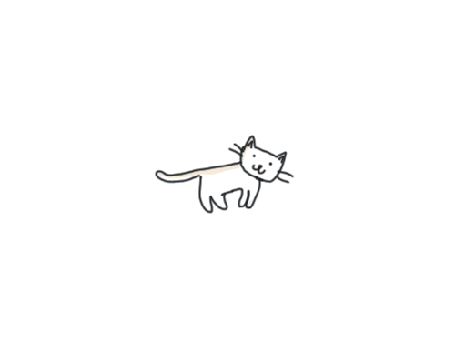

# Hey 👋 , I'm Rehana 
### 💻 Full Stack Web Developer | Cloud Architect in Progress  
> Writing a little bit of code with a lot of creativity. Built different. Built deployable. 🛠️

---

## Who Am I?

- 💻 Full-stack developer with a cloud-first mindset  
- Building scalable web apps using **MERN**, Firebase, and I use Arch btw  
- UI snob. Backend brawler. Deployment demon.  
- Addicted to problem-solving and data structures 

---

<h3 align="left">🌐 Connect with me</h3>

  
  
  

---

<h3 align="left">🛠️ Languages & Tools</h3>

  
  
  
  
  
  
  
  
  
  
  
  

---

## 🌟 Featured Project

### 💬 [BWMC Unfiltered](https://github.com/Rehana-Rahman/bwmc-unfiltered)

> 🔐 An anonymous gossip & discussion platform for students  
> 🌐 Built with MERN + Firebase  
> 💡 Realtime, fully anonymous, stylish AF, secure  

---

## 🐱 Fun Zone

I read fiction and attempt to write poetry.

Will probably beat you in chess and then write a haiku about it.

I watch anime, read manga and occasionally question reality.

I yap in English, Tamil, Hindi, Urdu — and sarcasm.

Will ghost you for a good book, a good game, or good biryani.

  

---

## 📊 GitHub Stats

  
  

---

> *"Code like nobody's watching, but push like everyone's reviewing."* — probably you, one day.

---

  

