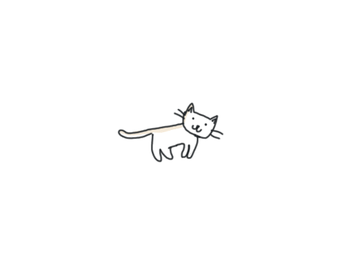

# hey, i'm rehana! 
```python
  class Rehana:
    def __init__(self):
        self.role = "backend-focused developer"
        self.based_in = "india"
        self.interests = ["coding", "chess", "anime", "reading"]
```

## whoami

> computer Applications graduate aiming to become a backend developer. I learn by building, not just reading, and I enjoy discussing systems, web, and real-world engineering problems.
> 
> i’ve interned across multiple programs and startups, working on practical projects that pushed me beyond tutorials. Always looking for opportunities to grow, ship, and contribute.
> 
> outside tech: chess, books, anime, social media management, and an unhealthy obsession with Neovim configs.

## skills

[](https://skillicons.dev)

## tools

[](https://skillicons.dev)

## socials

<p align="left">
  <a href="https://www.linkedin.com/in/rehana-rahman-4b2bb933b/" target="_blank">
    
  </a>
  <a href="mailto:rehanarahman004@gmail.com" target="_blank">
    
  </a>
  <a href="https://x.com/raydotsh" target="_blank">
    
  </a>
  <a href="https://discord.com/users/masterblueray" target="_blank">
    
  </a>
</p>

## more
* Read my blogs at [blogsite](https://rehanarahman.bearblog.dev)


<p align="center">
  
</p>
